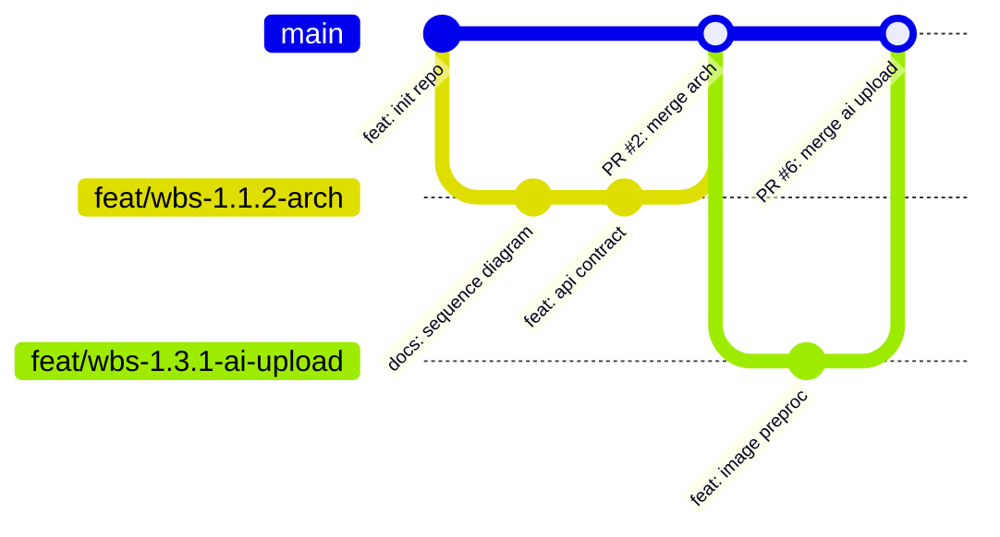

# ⏱️ QUY CHUẨN GIT & ĐỘNG CƠ GIẢ LẬP DÒNG THỜI GIAN (GIT GOVERNANCE & TEMPORAL ENGINE)
## RULESET 03: REALISTIC TEMPORAL PACING & CONVENTIONAL COMMITS

> **ID**: `TAGF-RULE-003`  
> **Phạm vi**: Mọi lệnh Git, cấu hình commit, sinh timestamp, cấu trúc nhánh và Pull Request.

---

## 1. ĐỘNG CƠ GIẢ LẬP DÒNG THỜI GIAN (TEMPORAL PACING ENGINE)

Để kho lưu trữ thể hiện lịch sử phát triển tự nhiên của con người, mọi commit được tạo (trong quá khứ hoặc hiện tại) đều phải tuân thủ nghiêm ngặt mô hình nhịp độ sinh học:

### 1.1. Lịch Trình 6 Sprints (12 Tuần)
| Sprint | Mốc Thời Gian Chuẩn | Trọng Tâm Phát Triển | Trạng Thái Kế Hoạch |
|---|---|---|---|
| **Sprint 1** | `2026-09-07` → `2026-09-20` | Khởi động, Yêu cầu, Kiến trúc & CSDL | `Done` |
| **Sprint 2** | `2026-09-21` → `2026-10-04` | Xác thực JWT & Nền tảng AI FastAPI | `In Progress` |
| **Sprint 3** | `2026-10-05` → `2026-10-18` | Google Vision API & Khám phá địa điểm | `Todo` |
| **Sprint 4** | `2026-10-19` → `2026-11-01` | Review, Booking Engine & Admin (100% MVP) | `Todo` |
| **Sprint 5** | `2026-11-02` → `2026-11-15` | Mạng xã hội, Chat Realtime, Tour/Khách sạn | `Todo` |
| **Sprint 6** | `2026-11-16` → `2026-11-29` | QA, Load Testing, Docker & Cloud Release | `Todo` |

### 1.2. Khung Giờ Commit Tự Nhiên (Human Work Hours Window)
- **Khung giờ hợp lệ**: Chỉ commit trong khoảng từ `09:30:00` đến `22:30:00` (giờ hành chính hoặc ca tối của lập trình viên).
- **Khoảng cách giữa các commit (Micro-Pacing)**:
  - **TUYỆT ĐỐI CẤM** tạo nhiều commit trong cùng một phút hoặc các commit cách nhau chỉ vài giây (dấu hiệu nhận biết rõ ràng của bot).
  - Khoảng cách thời gian hợp lý giữa 2 commit liên tiếp trên cùng một task là **từ 25 đến 75 phút** (thời gian con người viết code, debug và test).
- **Cơ chế thiết lập ngày giờ Git**:
  ```bash
  GIT_AUTHOR_DATE="YYYY-MM-DD HH:MM:SS +0700" \
  GIT_COMMITTER_DATE="YYYY-MM-DD HH:MM:SS +0700" \
  git commit --author="Tên Kỹ Sư <email>" -m "..."
  ```

---

## 2. QUY CHUẨN THÔNG ĐIỆP COMMIT (CONVENTIONAL COMMITS 1.0.0)

Mọi commit bắt buộc tuân theo định dạng:
```text
<type>(<scope>): <mô tả mệnh lệnh bằng tiếng Anh hoặc tiếng Việt kỹ thuật> (#<issue_id>)
```

### 2.1. Bảng Phân Loại Types & Scopes
- **Types**:
  - `feat`: Thêm tính năng nghiệp vụ mới.
  - `fix`: Sửa lỗi logic hoặc bảo mật.
  - `docs`: Cập nhật tài liệu kỹ thuật, sơ đồ kiến trúc Markdown.
  - `refactor`: Tái cấu trúc mã nguồn không làm thay đổi hành vi nghiệp vụ.
  - `perf`: Tối ưu hóa hiệu năng truy vấn SQL, giảm latency API.
  - `test`: Thêm unit test, integration test, mock test.
  - `chore`: Cấu hình Docker, dependency pom.xml / package.json / requirements.txt.
- **Scopes**:
  - `arch`, `ai`, `auth`, `place`, `booking`, `review`, `social`, `chat`, `admin`, `docker`, `ci`.

### 2.2. Ví Dụ Commit Mẫu Đạt Chuẩn 100%
```bash
# Đúng chuẩn WBS 1.1.2 (Issue #2)
git commit -m "feat(arch): design microservice architecture, inter-service api contract and docker baseline (#2)"

# Đúng chuẩn WBS 1.3.1 (Issue #6)
git commit -m "feat(ai): implement image validation and normalization pipeline (#6)"

# Đúng chuẩn WBS 1.2.1 (Issue #4)
git commit -m "feat(auth): implement user registration and bcrypt password hashing (#4)"
```

---

## 3. QUY TRÌNH QUẢN LÝ NHÁNH & PULL REQUEST (GITFLOW LITE)



1. **Cú pháp tên nhánh**:
   - Tính năng mới: `feat/wbs-<id>-<mo-ta-ngan>` (ví dụ: `feat/wbs-1.3.2-fastapi-service`)
   - Sửa lỗi: `fix/wbs-<id>-<mo-ta-loi>` (ví dụ: `fix/wbs-1.2.2-jwt-token-expired`)
2. **Quy tắc Merge**:
   - Merge vào `main` thông qua Pull Request có mô tả rõ ràng: *Tóm tắt thay đổi, Kịch bản đã test, Checklist Acceptance Criteria*.
   - Gắn cờ đóng Issue tự động: `Closes #<issue_id>` trong PR description.
