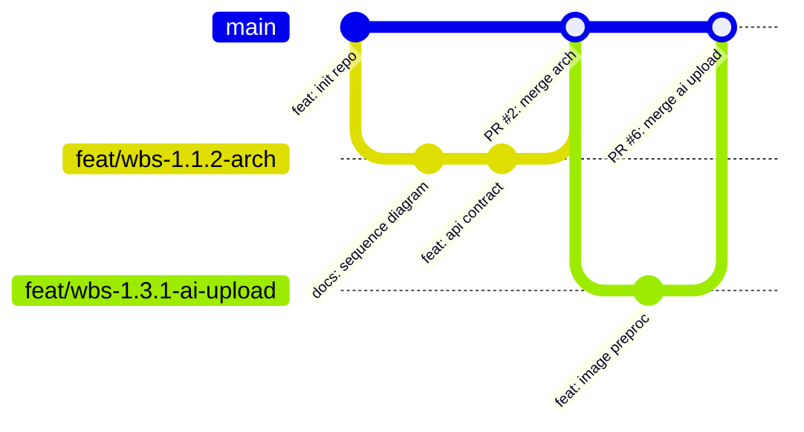

# ⏱️ GIT GOVERNANCE & TEMPORAL SIMULATION ENGINE
## RULESET 03: HUMAN PACING, CONVENTIONAL COMMITS & BRANCHING

> **ID**: `TAGF-RULE-003`  
> **Scope**: All Git commands, commit timestamps, branch names, PR workflows.

---

## 1. TEMPORAL SIMULATION & COMMIT PACING ENGINE

To ensure the repository history exhibits the organic, progressive characteristics of human engineering, all commits (past or present) must adhere to realistic temporal constraints:

### 1.1. Sprint Calendar (12-Week Production Schedule)
| Sprint | Official Date Range | Engineering Focus | Target State |
|---|---|---|---|
| **Sprint 1** | `2026-09-07` → `2026-09-20` | Project Initiation, Architecture, DB Modeling | `Done` |
| **Sprint 2** | `2026-09-21` → `2026-10-04` | Auth & Security, AI Microservice Foundation | `In Progress` |
| **Sprint 3** | `2026-10-05` → `2026-10-18` | Google Vision Integration, Destination Search | `Todo` |
| **Sprint 4** | `2026-10-19` → `2026-11-01` | Review System, Booking Engine, Admin Portal | `Todo` |
| **Sprint 5** | `2026-11-02` → `2026-11-15` | Social Feed, WebSocket Chat, Tour/Hotel Ext | `Todo` |
| **Sprint 6** | `2026-11-16` → `2026-11-29` | Full QA, Load Testing, Cloud CI/CD Release | `Todo` |

### 1.2. Human Working Hours & Micro-Pacing Rules
- **Realistic Working Window**: Commits must strictly fall within `09:30:00` and `22:30:00` (developer office hours or evening focus sessions).
- **Micro-Pacing Invariant**:
  - **ABSOLUTELY FORBIDDEN** to generate multiple commits within the same minute or within seconds of each other (bot signature).
  - The interval between consecutive commits on the same task must range between **25 and 75 minutes** (reflecting realistic authoring, local verification, and debugging time).
- **Commit Date Configuration Syntax**:
  ```bash
  GIT_AUTHOR_DATE="YYYY-MM-DD HH:MM:SS +0700" \
  GIT_COMMITTER_DATE="YYYY-MM-DD HH:MM:SS +0700" \
  git commit --author="Engineer Name <email>" -m "..."
  ```

---

## 2. CONVENTIONAL COMMITS 1.0.0 SPECIFICATION

Every commit message MUST adhere to the following schema:
```text
<type>(<scope>): <imperative summary> (#<issue_id>)
```

### 2.1. Standard Types & Scopes
- **Types**:
  - `feat`: New business feature or domain capability.
  - `fix`: Bug fix, exception patch, or security resolution.
  - `docs`: Technical documentation or architecture markdown updates.
  - `refactor`: Structural refactoring with unchanged behavioral semantics.
  - `perf`: Query optimization, caching, or latency reduction.
  - `test`: Unit tests, integration tests, or mock specifications.
  - `chore`: Dependency updates, Docker configuration, or CI pipeline changes.
- **Scopes**:
  - `arch`, `ai`, `auth`, `place`, `booking`, `review`, `social`, `chat`, `admin`, `docker`, `ci`.

### 2.2. Gold Standard Commit Examples
```bash
# Valid WBS 1.1.2 commit (Issue #2)
git commit -m "feat(arch): design microservice architecture, inter-service api contract and docker baseline (#2)"

# Valid WBS 1.3.1 commit (Issue #6)
git commit -m "feat(ai): implement image validation and normalization pipeline (#6)"

# Valid WBS 1.2.1 commit (Issue #4)
git commit -m "feat(auth): implement user registration and bcrypt password hashing (#4)"
```

---

## 3. BRANCHING TAXONOMY & PR WORKFLOW (GITFLOW LITE)



1. **Branch Naming Standard**:
   - Feature branches: `feat/wbs-<id>-<short-slug>` (e.g., `feat/wbs-1.3.2-fastapi-service`)
   - Bugfix branches: `fix/wbs-<id>-<short-slug>` (e.g., `fix/wbs-1.2.2-jwt-token-expiration`)
2. **Pull Request Protocol**:
   - PR description must include: *Summary of changes, Test scenarios executed, Acceptance Criteria checklist*.
   - Include auto-closing directive: `Closes #<issue_id>`.
3. **Review Thread Policy & AI Reviewers (Copilot)**:
   - Branch ruleset maintains `required_review_thread_resolution: false` on `main`.
   - Automated reviews from GitHub Copilot act as non-blocking architectural & security advisory inputs.
   - Engineers resolve identified issues through code commits and verification tests; manual click-resolution of individual Copilot comment threads is **NOT** a merge precondition, preventing workflow bottlenecks.

