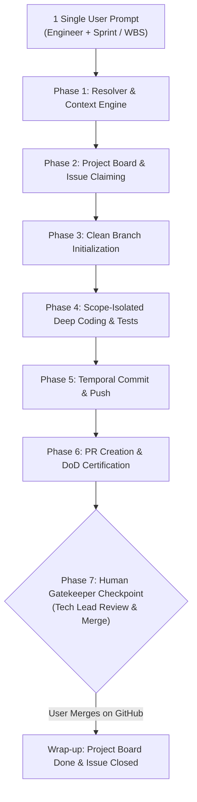

# 🤖 AUTONOMOUS SPRINT SESSION ORCHESTRATION & GATEKEEPING
## RULESET 07: 1-PROMPT AGENTIC EXECUTION, STATE MACHINE & HUMAN GATEKEEPER

> **ID**: `TAGF-RULE-007`  
> **Scope**: Autonomous end-to-end sprint session workflows, GitHub CLI orchestration, RACI firewalls, Human-in-the-Loop review gatekeeping.

---

## 1. PURPOSE & AGENTIC OPERATION THESIS

The **Autonomous Sprint Session** mechanism allows any authorized engineering session to be triggered by a single concise user prompt (e.g., *"Sprint 2 - Thuận - WBS 1.3.1"* or *"Thực hiện ca làm việc tiếp theo cho Đức"*). 

Upon invocation, the agent MUST autonomously execute the complete 7-Phase Sprint Cycle without requiring intermittent manual prompting, stopping strictly at the **Human Review Gatekeeper (Phase 7)** where the Tech Lead (`@AtelierMizumi`) conducts the final review and merge on GitHub.



---

## 2. THE 7-PHASE AUTONOMOUS STATE MACHINE

### Phase 1: Context & RACI Resolver
The agent reads the input directive and resolves:
1. **Target Engineer**:
   - **Trần Minh Thuận**: `@AtelierMizumi` | `Minh Thuận Trần <thuanc177@gmail.com>` | Packages: `1.1.1`, `1.1.2`, `1.1.3`, `1.3.1`, `1.3.2`, `1.8.2`.
   - **Hoàng Văn Đức**: `@duchayslay` | `Hoàng Văn Đức <hoangvanduc290805@gmail.com>` | Packages: `1.2.1`, `1.4.2`, `1.4.3`, `1.5.1`, `1.6.1`, `1.6.3`, `1.7.2`, `1.7.3`, `1.7.4`, `1.7.5`.
   - **Lê Văn Ngọc**: `@ngoctapcodee` | `Lê Văn Ngọc <ngoc492005@gmail.com>` | Packages: `1.2.2`, `1.3.3`, `1.4.1`, `1.5.2`, `1.6.2`, `1.7.1`, `1.7.6`, `1.8.1`.
2. **Target WBS & Issue #**: Match against the Sprint Schedule in [`06_agile_lifecycle_and_definition_of_done.md`](./06_agile_lifecycle_and_definition_of_done.md). If unspecified, automatically select the next uncompleted issue in the active sprint assigned to that engineer.
3. **Temporal Window**: Determine the calendar dates of the active Sprint (Weeks 1 to 12) and schedule commits within developer working hours (`09:30 - 22:30 +0700`).

### Phase 2: Project Board & Issue Claiming (GitHub Sync)
Before writing any code, the agent synchronizes state via `gh` CLI:
1. **Assign Issue**: Assign the issue to the target engineer's GitHub handle:
   ```bash
   gh issue edit <issue_id> --add-assignee "<github_username>"
   ```
2. **Update Project Status**: Transition card on Project #2 (`PVT_kwHOBbhbZ84Bk25F`) from `Todo` to `In Progress`.

### Phase 3: Clean Branch Initialization
1. Ensure working tree is clean: `git status -s`.
2. Fetch and checkout latest `main`: `git checkout main && git pull origin main`.
3. Create feature branch conforming to Gitflow Lite:
   ```bash
   git checkout -b feat/wbs-<id>-<short-slug>
   ```

### Phase 4: Scope-Isolated Deep Coding & Verification
1. **RACI Firewall**: The agent MUST ONLY modify or create files within the target engineer's architectural boundary. Zero modification to external modules unless interface contracts require it.
2. **File Hygiene Invariant**: Zero office/binary files (`*.docx`, `*.xlsx`, `*.pdf`, `local_references/`).
3. **Clean Code & RFC 7807**: Implement production-grade logic without debug remnants (`print`, `console.log`, `System.out.println`). Error responses must adhere to RFC 7807 Problem Details.
4. **Local Verification**: Execute relevant unit/integration test harness (e.g. `pytest` for AI service, `mvn test` for Spring Boot, `npm run build` for React).
5. **Circuit Breaker**: If tests fail, the agent has a budget of 2 auto-debugging attempts. If still failing, HALT and report errors; NEVER commit broken code.

### Phase 5: Temporal Commit & Push
1. Stage modified files explicitly: `git add <paths>`.
2. Craft Conventional Commit with Issue ID:
   ```bash
   GIT_AUTHOR_DATE="YYYY-MM-DD HH:MM:SS +0700" \
   GIT_COMMITTER_DATE="YYYY-MM-DD HH:MM:SS +0700" \
   git commit --author="<Name> <<Email>>" -m "<type>(<scope>): <summary> (#<issue_id>)"
   ```
3. Push to remote:
   ```bash
   git push -u origin feat/wbs-<id>-<short-slug>
   ```

### Phase 6: Pull Request Creation & DoD Certification
Create Pull Request using `gh pr create` with auto-closing directive and complete DoD verification:
```bash
gh pr create --title "<type>(<scope>): <summary> (#<issue_id>)" --body "$(cat << 'EOF'
## 🎯 Purpose & Scope
Closes #<issue_id> - Implements WBS <id>

## 📦 Key Deliverables & Changes
- ...

## 🧪 Verification & Test Results
- [x] Local test suite executed and passed
- [x] Zero office/binary files staged
- [x] RFC 7807 Problem Details compliant

## 📋 Definition of Done (DoD) Checklist
- [x] Clean Layered Architecture conventions respected
- [x] Zero debug logs remaining
- [x] Conventional Commit linked to Issue #<issue_id>
- [x] Ready for Tech Lead Code Review
EOF
)"
```

### Phase 7: Human Gatekeeper Checkpoint (MANDATORY STOP)
🛑 **AGENT MUST HALT HERE**:
- The agent **DOES NOT** autonomously merge the Pull Request into `main`.
- Output a structured, human-readable summary report to the user:
  - Engineer & WBS task executed
  - Branch name & Commit SHA
  - Clickable Pull Request URL
  - Test evidence & DoD confirmation
- Await the Tech Lead (`@AtelierMizumi`) to review and merge the PR on GitHub.

---

## 3. POST-MERGE ROADMAP & BOARD SYNCHRONIZATION

Once the Tech Lead reviews and merges the Pull Request (or instructs the agent to wrap up):
1. Transition card on Project #2 to `Done`.
2. Verify linked issue is closed (`gh issue view <issue_id>`).
3. Delete local feature branch: `git checkout main && git pull origin main && git branch -d feat/wbs-...`.
4. Update Sprint Traceability Matrix in documentation.

---

## 4. SAFETY INVARIANTS & ERROR RECOVERY

1. **RACI Firewall Breach Protection**: If a prompt requests an engineer to write code outside their designated WBS packages, the agent MUST refuse and explain the RACI boundary.
2. **Zero-Pollution Guarantee**: Pre-push verification ensures no temporary artifacts, `.pyc`, or quarantined directories are staged.
3. **Deterministic State Recovery**: If any remote Git operation fails (network timeout, merge conflict), the agent must preserve the working branch and output clear remediation instructions without force pushing.
