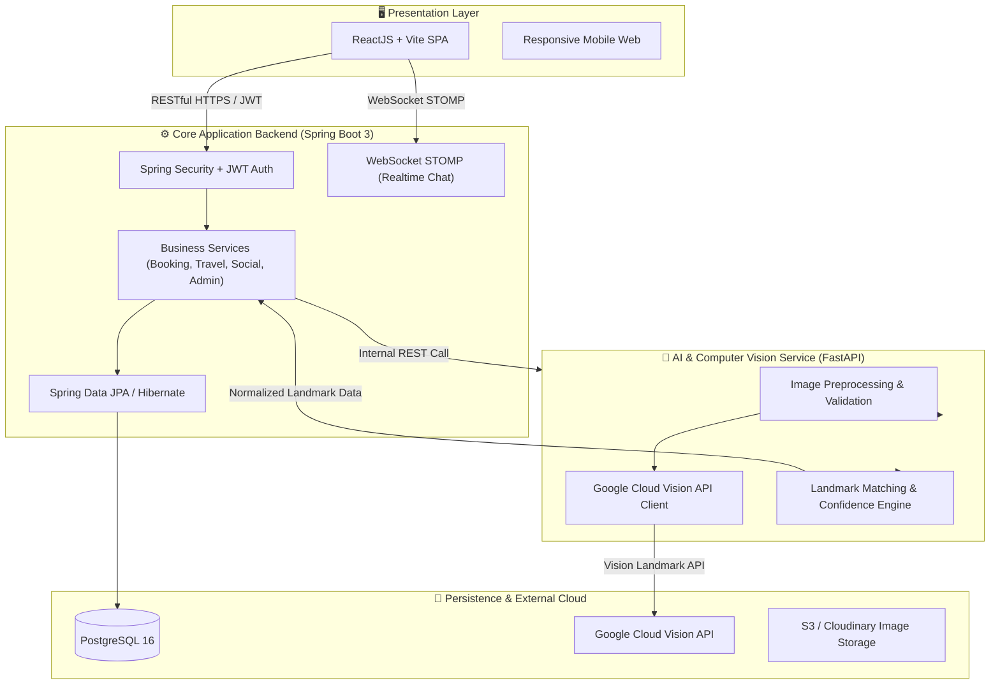

# 🌏 TravelAI - Intelligent Landmark Recognition & Travel Platform

**TravelAI** là nền tảng du lịch thông minh thế hệ mới, ứng dụng trí tuệ nhân tạo (Computer Vision & AI Landmark Detection) để tự động nhận diện danh lam thắng cảnh từ hình ảnh của du khách, kết nối liền mạch với hệ sinh thái khám phá điểm đến, đặt phòng khách sạn / tour du lịch, đánh giá cộng đồng và trò chuyện thời gian thực.

---

## 🏛️ Kiến Trúc Hệ Thống (System Architecture)

Hệ thống được thiết kế theo mô hình **Microservices-oriented Monolith**, phân tách rõ ràng giữa Core Business Backend, AI Recognition Microservice và High-Performance Client:

---

## 💻 Tech Stack Chuẩn Doanh Nghiệp

| Thành Phần | Công Nghệ | Vai Trò & Chức Năng |
|---|---|---|
| **Frontend** | React 18, Vite, TailwindCSS, Lucide Icons, Axios | Single Page Application tốc độ cao, responsive đa thiết bị, trải nghiệm mượt mà. |
| **Backend Core** | Java 17, Spring Boot 3, Spring Security | Xử lý logic nghiệp vụ, quản lý phiên JWT, phân quyền RBAC, booking engine, WebSocket chat. |
| **AI Microservice** | Python 3.11, FastAPI, Pydantic, Pillow, OpenCV | Service nhận diện ảnh phi tập trung, tiền xử lý và kết nối Google Cloud Vision API. |
| **Cơ sở dữ liệu** | PostgreSQL 16 | Lưu trữ quan hệ ACID: người dùng, địa danh, tour, khách sạn, đơn đặt chỗ, bài viết & đánh giá. |
| **Hạ tầng & DevOps** | Docker, Docker Compose, GitHub Actions | Containerization chuẩn hóa môi trường phát triển và pipeline CI/CD tự động. |

---

## 👥 Cơ Cấu Đội Ngũ Phát Triển (Team Structure - 3 Kỹ Sư)

Dự án được phân bổ công việc theo mô hình Agile Scrum chuyên nghiệp với 3 vai trò kỹ sư:

- **Kỹ sư 1 (Tech Lead / AI & Fullstack Integration)**: Phụ trách kiến trúc tổng thể, AI Service (FastAPI, Google Vision API), tích hợp luồng nhận diện ảnh và luồng kết nối liên dịch vụ.
- **Kỹ sư 2 (Core Backend & Database Engineer)**: Phụ trách Spring Boot Core, thiết kế lược đồ CSDL PostgreSQL, xác thực JWT & bảo mật RBAC, module Đặt chỗ (Booking) và Quản trị hệ thống (Admin).
- **Kỹ sư 3 (Frontend & UI/UX Engineer)**: Phụ trách giao diện ReactJS, trải nghiệm người dùng (UX), luồng Khám phá điểm đến, Viết đánh giá (Reviews), Mạng xã hội và Chat thời gian thực.

---

## 🚀 Quản Lý Dự Án & Lộ Trình Phát Triển (Agile / Scrum Roadmap)

Dự án được quản lý trực tiếp thông qua **GitHub Projects**, chia thành **6 Sprints** (mỗi Sprint 2 tuần, tổng cộng 12 tuần) với **25 gói công việc (Work Packages)** tuân thủ phương pháp MoSCoW:

👉 **Truy cập bảng điều khiển dự án:** [**TravelAI - Project Board & Sprint Backlog**](https://github.com/users/AtelierMizumi/projects/2)

### 📌 Thống Kê Phân Bổ MoSCoW
- **Core MVP (Must-Have)**: `15 gói công việc` (**60%**) - Hoàn thành toàn diện tại Sprint 4.
- **Enhanced Experience (Should/Could-Have)**: `10 gói công việc` (**40%**) - Mở rộng và hoàn thiện tại Sprint 5 - 6.

---

### 📅 Chi Tiết 6 Sprints

#### 🔹 Sprint 1 (Tuần 1 - 2): Khởi Động & Thiết Kế Kiến Trúc
*Trạng thái: `Done` | Thời gian: 07/09/2026 - 20/09/2026*
- `[WBS 1.1.1]` Khởi động & xác định yêu cầu nghiệp vụ ([#1](https://github.com/AtelierMizumi/TravelAI/issues/1))
- `[WBS 1.1.2]` Thiết kế kiến trúc hệ thống đa dịch vụ ([#2](https://github.com/AtelierMizumi/TravelAI/issues/2))
- `[WBS 1.1.3]` Thiết kế CSDL quan hệ & mô hình dữ liệu PostgreSQL ([#3](https://github.com/AtelierMizumi/TravelAI/issues/3))

#### 🔹 Sprint 2 (Tuần 3 - 4): Xác Thực Bảo Mật & Nền Tảng AI Service
*Trạng thái: `In Progress` | Thời gian: 21/09/2026 - 04/10/2026*
- `[WBS 1.2.1]` Module Đăng ký / Đăng nhập ([#4](https://github.com/AtelierMizumi/TravelAI/issues/4))
- `[WBS 1.2.2]` Quản lý Hồ sơ người dùng & cơ chế bảo mật JWT ([#5](https://github.com/AtelierMizumi/TravelAI/issues/5))
- `[WBS 1.3.1]` Pipeline Upload & tiền xử lý hình ảnh ([#6](https://github.com/AtelierMizumi/TravelAI/issues/6))
- `[WBS 1.3.2]` Khung AI Microservice bằng FastAPI ([#7](https://github.com/AtelierMizumi/TravelAI/issues/7))

#### 🔹 Sprint 3 (Tuần 5 - 6): AI Nhận Diện Địa Danh & Khám Phá Điểm Đến
*Trạng thái: `Todo` | Thời gian: 05/10/2026 - 18/10/2026*
- `[WBS 1.3.3]` Tích hợp Google Cloud Vision API nhận diện Landmark ([#8](https://github.com/AtelierMizumi/TravelAI/issues/8))
- `[WBS 1.3.4]` Giao diện hiển thị kết quả phân tích AI ([#9](https://github.com/AtelierMizumi/TravelAI/issues/9))
- `[WBS 1.5.1]` Tính năng tìm kiếm & khám phá điểm đến du lịch ([#10](https://github.com/AtelierMizumi/TravelAI/issues/10))

#### 🔹 Sprint 4 (Tuần 7 - 8): Quản Trị Cốt Lõi, Đánh Giá & Dịch Vụ Đặt Chỗ (Hoàn Thành 100% MVP)
*Trạng thái: `Todo` | Thời gian: 19/10/2026 - 01/11/2026*
- `[WBS 1.4.3]` Viết & hiển thị đánh giá (Reviews & Ratings) ([#11](https://github.com/AtelierMizumi/TravelAI/issues/11))
- `[WBS 1.5.4]` Luồng đặt Tour / Khách sạn & thanh toán trực tuyến ([#12](https://github.com/AtelierMizumi/TravelAI/issues/12))
- `[WBS 1.6.1]` Dashboard điều hành trung tâm cho Quản trị viên ([#13](https://github.com/AtelierMizumi/TravelAI/issues/13))
- `[WBS 1.6.2]` Quản trị thành viên & phân quyền hệ thống ([#14](https://github.com/AtelierMizumi/TravelAI/issues/14))
- `[WBS 1.6.3]` Quản trị danh mục điểm du lịch & đối sánh dữ liệu ([#15](https://github.com/AtelierMizumi/TravelAI/issues/15))

#### 🔹 Sprint 5 (Tuần 9 - 10): Mạng Xã Hội Du Lịch & Dịch Vụ Mở Rộng
*Trạng thái: `Todo` | Thời gian: 02/11/2026 - 15/11/2026*
- `[WBS 1.4.1]` Đăng bài viết chia sẻ trải nghiệm & album ảnh ([#16](https://github.com/AtelierMizumi/TravelAI/issues/16))
- `[WBS 1.4.2]` Tương tác mạng xã hội: Like, Comment, Follow ([#17](https://github.com/AtelierMizumi/TravelAI/issues/17))
- `[WBS 1.4.4]` Kênh Chat thời gian thực với WebSocket ([#18](https://github.com/AtelierMizumi/TravelAI/issues/18))
- `[WBS 1.5.2]` Danh mục & chi tiết các gói Tour du lịch ([#19](https://github.com/AtelierMizumi/TravelAI/issues/19))
- `[WBS 1.5.3]` Danh mục & chi tiết hệ thống Khách sạn lân cận ([#20](https://github.com/AtelierMizumi/TravelAI/issues/20))
- `[WBS 1.6.4]` Hệ thống quản lý đơn đặt chỗ cho quản trị viên ([#21](https://github.com/AtelierMizumi/TravelAI/issues/21))
- `[WBS 1.6.5]` Kiểm duyệt bài viết cộng đồng & cấu hình hệ thống ([#22](https://github.com/AtelierMizumi/TravelAI/issues/22))

#### 🔹 Sprint 6 (Tuần 11 - 12): Kiểm Thử Toàn Diện, Triển Khai Cloud & Phát Hành
*Trạng thái: `Todo` | Thời gian: 16/11/2026 - 29/11/2026*
- `[WBS 1.7.1]` Kiểm thử tích hợp liên dịch vụ & kiểm thử chức năng E2E ([#23](https://github.com/AtelierMizumi/TravelAI/issues/23))
- `[WBS 1.7.2]` Kiểm thử hiệu năng, tải cao (Load Testing) & bảo mật ([#24](https://github.com/AtelierMizumi/TravelAI/issues/24))
- `[WBS 1.7.3]` Đóng gói Docker, triển khai Cloud hạ tầng & phát hành ([#25](https://github.com/AtelierMizumi/TravelAI/issues/25))

---

## 🛠️ Quy Chuẩn Đóng Góp & Commit (Contribution Guide)

Hệ thống tuân thủ nghiêm ngặt quy chuẩn kỹ thuật phần mềm:
- **Conventional Commits**: `feat:`, `fix:`, `refactor:`, `docs:`, `test:`, `chore:` kèm liên kết Issue (ví dụ: `feat(ai): integrate Google Vision landmark detection (#8)`).
- **Branching Model**: Nhánh tính năng theo quy tắc `feat/wbs-<id>-<ten-ngan>`, `fix/...`.
- **Code Quality**: Code review, unit test và tích hợp liên tục trước khi merge vào nhánh `main`.
