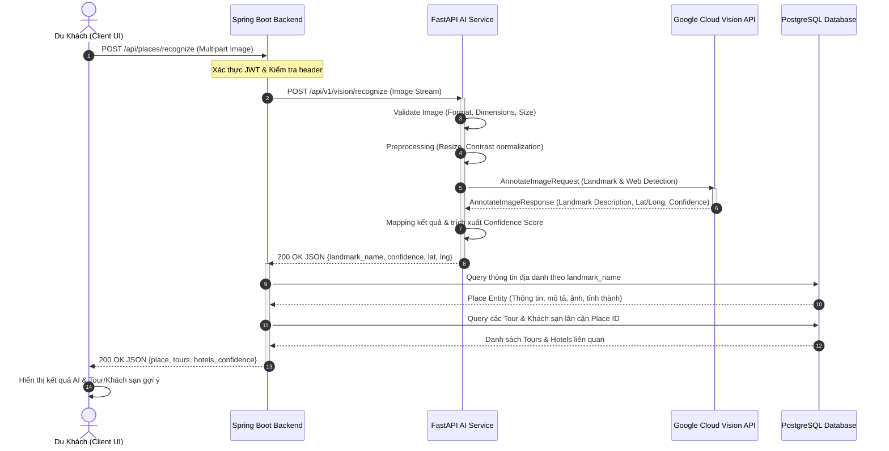
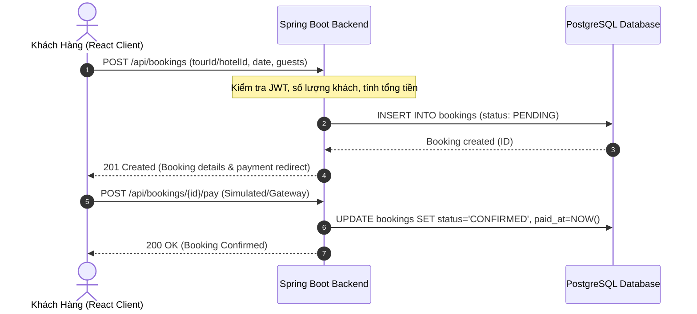

# 🏛️ TÀI LIỆU THIẾT KẾ KIẾN TRÚC HỆ THỐNG (SYSTEM ARCHITECTURE)

> **Mã công việc WBS**: `1.1.2 - Thiết kế kiến trúc hệ thống`  
> **Người thực hiện**: Trần Minh Thuận (Tech Lead / System Architect)  
> **Phiên bản**: `1.0.0` | **Sprint**: `Sprint 1 (Tuần 1 - 2)`  
> **Liên kết Issue**: [Issue #2](https://github.com/AtelierMizumi/TravelAI/issues/2)

---

## 1. MÔ HÌNH KIẾN TRÚC TỔNG THỂ (HIGH-LEVEL ARCHITECTURE)

TravelAI được xây dựng theo kiến trúc **Microservices-oriented Monolith**, kết hợp ưu điểm của tính toàn vẹn dữ liệu trong Core Backend và tính linh hoạt, mở rộng cao của AI Microservice:

```
┌─────────────────────────────────────────────────────────────────────────────┐
│                         PRESENTATION LAYER (CLIENT)                         │
│                    ReactJS 18 + Vite + TailwindCSS SPA                      │
│                [Traveler Web Portal]  &  [Admin Management]                 │
└──────────────────────────────────────┬──────────────────────────────────────┘
                                       │ HTTPS / JSON REST & WebSocket STOMP
                                       ▼
┌─────────────────────────────────────────────────────────────────────────────┐
│                    CORE BACKEND (JAVA SPRING BOOT 3)                        │
│   ┌───────────────────────────┐      ┌──────────────────────────────────┐   │
│   │   Spring Security + JWT   │      │       WebSocket STOMP Broker     │   │
│   ├───────────────────────────┤      ├──────────────────────────────────┤   │
│   │   Booking & Payment Engine│      │       Review & Rating Service    │   │
│   ├───────────────────────────┤      ├──────────────────────────────────┤   │
│   │   Place & Discovery Svc   │      │       User & Admin Control       │   │
│   └─────────────┬─────────────┘      └──────────────────────────────────┘   │
│                 │ Spring Data JPA                                           │
└─────────────────┼────────────────────────────────────┬──────────────────────┘
                  │                                    │ Internal REST Call
                  ▼                                    ▼
┌───────────────────────────────┐     ┌───────────────────────────────────────┐
│     POSTGRESQL 16 DATABASE    │     │      AI RECOGNITION SERVICE (FASTAPI) │
│  - Users, Roles, Permissions  │     │   - Image Preprocessing Pipeline      │
│  - Places, Categories, Photos │     │   - Google Cloud Vision SDK Client    │
│  - Tours, Hotels, Bookings    │     │   - Landmark Mapping Engine           │
│  - Reviews, Posts, Comments   │     └───────────────────┬───────────────────┘
└───────────────────────────────┘                         │ gRPC / HTTPS
                                                          ▼
                                      ┌───────────────────────────────────────┐
                                      │     GOOGLE CLOUD VISION API (CLOUD)   │
                                      │  - Landmark Detection                 │
                                      │  - Web Detection (Fallback)           │
                                      └───────────────────────────────────────┘
```

---

## 2. LUỒNG TƯƠNG TÁC CHI TIẾT (SEQUENCE DIAGRAMS)

### 2.1. Luồng Nhận Diện Địa Danh Bằng AI (AI Landmark Recognition Flow)
Luồng xử lý từ khi người dùng tải ảnh lên cho đến khi nhận được kết quả và gợi ý dịch vụ liên quan:



### 2.2. Luồng Đặt Chỗ Dịch Vụ (Booking & Payment Flow)


---

## 3. BẢO MẬT & PHÂN QUYỀN HỆ THỐNG (SECURITY ARCHITECTURE)

1. **Xác thực phiên làm việc (Authentication)**:
   - Sử dụng kiến trúc Stateless Session dựa trên **JSON Web Token (JWT)**.
   - Access Token: Thời hạn 2 giờ, đính kèm trong header `Authorization: Bearer <token>`.
   - Refresh Token: Thời hạn 7 ngày, lưu trữ bảo mật để cấp lại access token.
2. **Phân quyền truy cập (Authorization & RBAC)**:
   - `ROLE_USER`: Khám phá địa điểm, upload ảnh AI, đặt tour/khách sạn, viết bài, review, chat.
   - `ROLE_ADMIN`: Toàn quyền truy cập bảng điều khiển Admin, quản trị người dùng, địa danh và duyệt đơn đặt chỗ.
3. **Phòng thủ đa tầng (Defense in Depth)**:
   - Password Hashing: Thuật toán BCrypt với Cost Factor = 10.
   - CORS Configuration: Chỉ cho phép nguồn từ các domain tin cậy được chỉ định.
   - Rate Limiting: Hạn chế tần suất gọi API nhận diện AI để bảo vệ quota Google Vision API.
